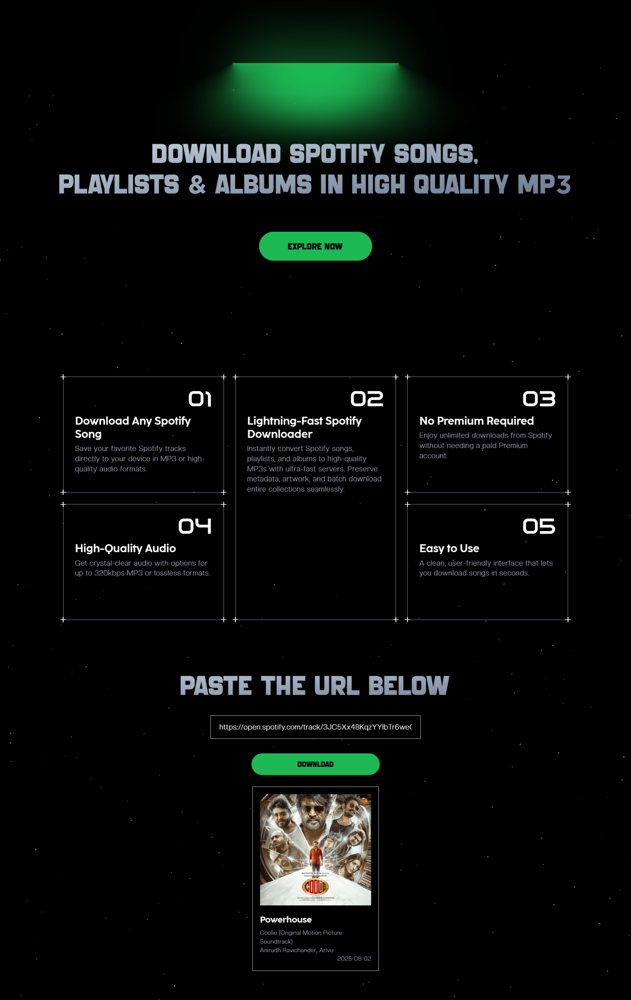

# 🎵 Spotify Downloader – Download Songs, Playlists & Albums in MP3

**Spotify Downloader** is a blazing-fast React web application that lets you **download Spotify songs, playlists, and albums** directly in **high-quality MP3, AAC, or FLAC formats**.  
No Spotify Premium required. Preserve **album artwork, metadata, and original audio quality** – all for free.


## 🖼 Screenshot



---

## 🚀 Features

- **Download Any Spotify Song** – Save your favorite tracks instantly.
- **Playlist & Album Support** – Batch download entire collections.
- **High-Quality Audio** – Get up to **320kbps MP3** or **lossless formats**.
- **No Premium Required** – Works with a free Spotify account.
- **Lightning-Fast** – Optimized servers for ultra-quick conversions.
- **Full Metadata** – Keep song title, artist, release year, and album cover.

---

## 🌍 Live Demo

Try the live version here:  
[🔗 Spotify Downloader – Live](https://thinakaranmanokaran.github.io/spotmix-downloader/)

---


## 📦 Installation & Setup

### Prerequisites
- **Node.js** (LTS recommended)
- **npm** or **yarn**

### Steps

```bash
# 1. Clone the repository
git clone https://github.com/thinakaranmanokaran/spotify-downloader.git
cd spotify-downloader

# 2. Install dependencies
npm install   # or yarn install

# 3. Start the development server
npm start     # or yarn start
````

Visit **[http://localhost:3000](http://localhost:3000)** in your browser.

---

## 📥 How to Use

1. **Copy** any Spotify track, playlist, or album URL.
2. **Paste** the link into the input field on the website.
3. **Verify** to fetch details like album name, cover image, artist, and release date.
4. **Download** the song(s) instantly in your preferred format.

---

## 🚀 Deployment (GitHub Pages)

1. In `package.json`, set the `homepage`:

   ```json
   "homepage": "https://thinakaranmanokaran.github.io/spotmix-downloader/"
   ```
2. Run:

   ```bash
   npm run deploy
   ```
3. Your site will be live on GitHub Pages.

---

## 🛠 Tech Stack

* **React.js** – Frontend framework
* **Tailwind CSS** – Styling
* **Spotify Downloader API** – Fetches song details and download links
* **GitHub Pages** – Deployment

---

## 🤝 Contributing

Contributions are welcome!
Follow these steps:

```bash
# 1. Fork the repo
# 2. Create a branch
git checkout -b feature-branch

# 3. Commit your changes
git commit -m "Add new feature"

# 4. Push and submit PR
git push origin feature-branch
```

---

## 📜 License

This project is licensed under the **MIT License** – see the [LICENSE](LICENSE) file.

---

## 😇 Author

[Thinakaran Manokaran](https://thinakaran.dev)

---

### 📈 SEO Keywords


```

Spotify downloader, Spotify song download, download Spotify playlist MP3, Spotify to MP3, free Spotify music downloader, download Spotify album, Spotify MP3 converter, download Spotify without premium

```
